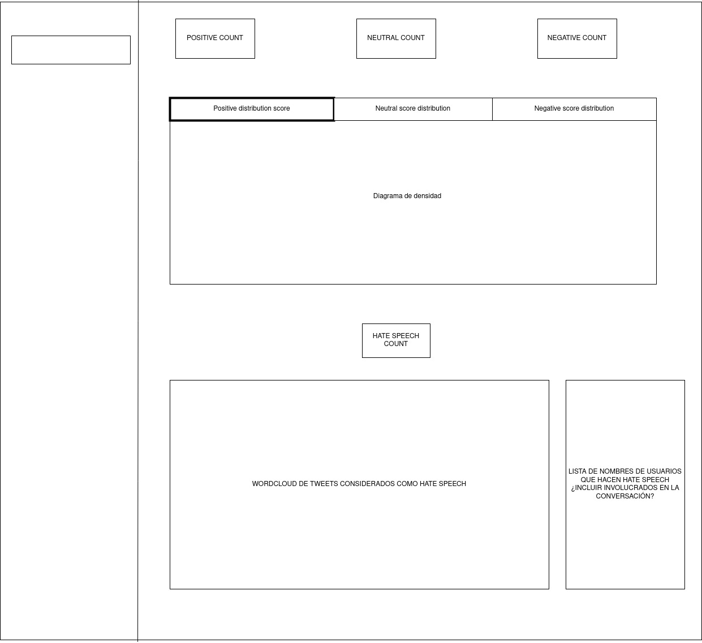

## Running stream

In one console:

    python src/twitter_stream.py

In other console:

    python src/stream_consumer.py 

## Troubleshooting

### **Streamed Fields to null:**

If all fields of streamed data appears as null, it can be because there is something wrong with the data. When SparkStreaming doesn't understarnd a field it put every field to null. An example would be passing a None value instead of null, as Spark interprets it as a String.

### **Module not found inside UDF:**

- Set it for session in venv:
    
    With virtualenv activated enter next command.

        #! /bin/sh

        PYSPARK_PYTHON=./venv/bin/python

- Set it forever in venv:

        nano venv/bin/activate

    In the end of the file:

        export PYSPARK_PYTHON=./venv/bin/python
        export FLASK_APP=model/app.py
    
    https://stackoverflow.com/questions/9554087/setting-an-environment-variable-in-virtualenv 

Running flask:

    flask run --host=0.0.0.0

# Scope

Dashboard en tiempo real con la siguiente estructura:

Lo único que se va a usar es el texto de los tweets sin tener en cuenta las menciones, hashtags y retweets

En un futuro se podría añadir un hashtag para analizar el contenido de este. De momento la importancia está en hacer el dashboard para entender mejor las limitaciones del stream y cómo usarlas con base de datos o si hay que añadir Kafka o algo del estilo. 

# Tareas

## To define better

- Create general wordcloud 
- Make the process more robust and failure tolerant

## To do
- Check how to get user information only having the tweet from stream [ - ]

- Add hate speech detection (HSD)
    - Find model of HSD [ - ]
    - Add model to Flask API as new endpoint [ - ]
    - Modify pipeline to add call and handle response [ - ]

- Create dashboard MVP:
    - Create hate speech wordcloud[ - ]

- Search better sentiment analysis models [ - ]
- Create Data Model [ - ]
- Create Queries [ - ]
- Get author information and the users who are mentioned in the tweet [ - ]
- Make the stream not break on error in twitter_stream.py [ - ]
- Clean data from sequential process in tweets

## In progress

## Done

- Create dashboard mock [  &#x2714; ] 01/11/2022
- Make the stream not break on error in stream_consumer.py [ &#x2714; ] 19/11/2022
- Create a database controller and refactor code [  &#x2714; ]
- Create dashboard MVP:

    - Create classification count [  &#x2714; ]
